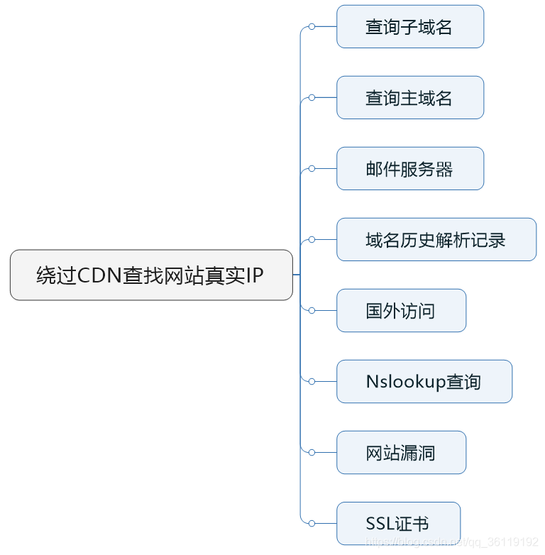
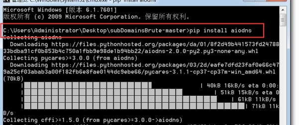
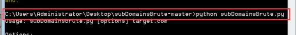
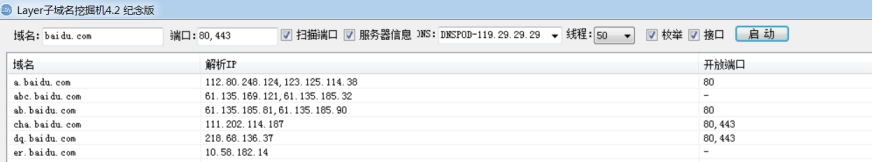
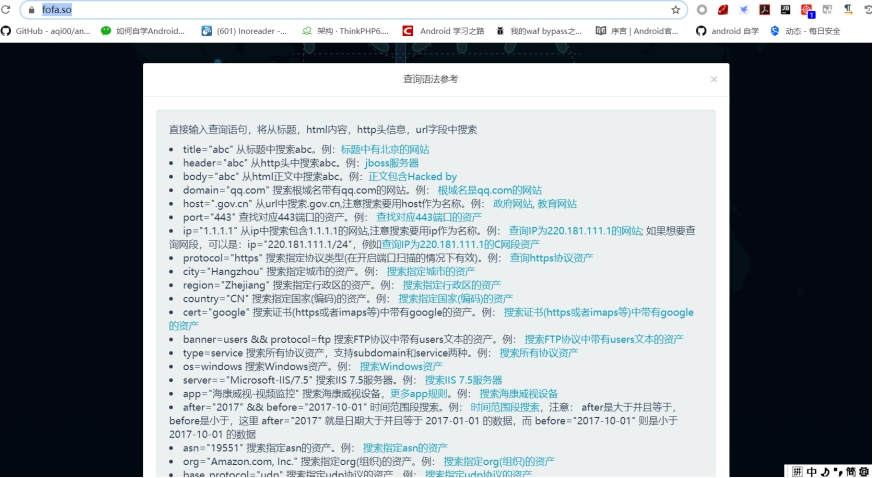

# 信息收集

### 1、简述一下渗透测试的流程

```
1. 1 信息收集
robots文件是否暴露服务器的敏感目录，服务器的真实ip，开放端口，WAF等
查看服务器操作系统版本，web中间件，看看是否存在已知的漏洞，比如IIS，APACHE,NGINX的解析漏洞
网站指纹识别 cms，cdn
查询服务器旁站以及子域名站点，因为主站一般比较难，所以先看看旁站有没有通用性的cms或者其他漏洞。
通过御剑、dirbuster、awvs、扫描网站目录结构，爆后台，网站banner，测试文件，数据库备份等敏感文件等
网站的参数传递方式(通过伪静态还是路由还是常规的参数传递、是否对传递的参数进行加密、是否是类似.do、.action、?m=xx&c=xx&a=xx)
whois信息，姓名，备案，邮箱，电话反查（邮箱丢社工库，社工准备等）
google hacking针对化搜索，pdf文件，中间件版本，弱口令扫描等


1.2 漏洞挖掘(常规web漏洞挖掘)
一定要多抓包分析
端口，弱口令，目录等扫描,对响应的端口进行漏洞探测，比如mysql,ftp,ssh弱口令等。
XSS，SQL注入，文件上传，命令注入，CSRF，cookie安全检测，敏感信息，通信数据传输，暴力破解，任意文件上传，越权访问，未授权访问，目录遍历，文件 包含，重放攻击（短信轰炸），服务器漏洞检测，最后使用漏扫工具等

1.3 漏洞利用&获取webshell进行权限提升
mysql提权，serv-u提权，redis未授权提权，
windows 溢出提权
linux脏牛,内核漏洞提权

1.4 清除测试数据&输出报告

日志、测试数据的清理
总结，输出渗透测试报告，附修复方案

1.5 复测

验证并发现是否有新漏洞，输出报告，归档
```

### 2、 拿到一个待检测的站，你觉得应该先做什么？

```
2.1.1 信息收集

1、获取域名的whois信息,获取注册者邮箱姓名电话等，丢社工库里看看有没有泄露密码，然后尝试用泄露的密码进行登录后台。用邮箱做关键词进行丢进搜索引擎。利用搜索到的关联信息找出其他邮箱进而得到常用社交账号。社工找出社交账号，里面或许会找出管理员设置密码的习惯 。利用已有信息生成专用字典。
2、查询服务器旁站以及子域名站点，因为主站一般比较难，所以先看看旁站有没有通用性的cms或者其他漏洞。
3、查看服务器操作系统版本，web中间件，看看是否存在已知的漏洞，比如IIS，APACHE,NGINX的解析漏洞
4、查看IP，进行IP地址端口扫描，对响应的端口进行漏洞探测，mysql,ftp,ssh弱口令等。
5、扫描网站目录结构，看看是否可以遍历目录，或者敏感文件泄漏，比如php探针
6、google hack 进一步探测网站的信息，后台，敏感文件

如何扩大攻击面呢？
1.收集尽量全的企业域名（包括各种子域名以及子公司的域名，越全越好）
2.收集尽量全的企业申请的公网 IP
3.对所有收集到的域名以及 IP 地址进行端口扫描（由于时间可能比较久，所以可以
选择利用 zoomeye、shodan、censys 等平台）
4.针对不同的服务进行对应的渗透测试（尤其是可能存在漏洞的中间件）
```


## Cdn绕过

CDN就是内容分发网络，是构建在网络之上的内容分发网络，依靠部署在各地的边缘服务器，通过中心平台的负载均衡、内容分发、调度等功能模块，使用户就近获取所需内容，降低网络拥塞，提高用户访问响应速度和命中率。CDN的关键技术主要有内容存储和分发技术。

```
0.站长之家 多ping
1.通过该网站的邮件服务器   内部邮箱源，收集到内部邮箱服务器IP地址(bc、杀猪盘、贷款有些不合适)
2.网站phpinfo文件 phpinfo.php
3.分站IP地址，查询子域名 CDN很贵，很有可能分站就不再使用CDN。(这个算是比较重要的)
4.通过特定网站查找该网站域名历史解析记录
5.海外ip访问(没有对外部ip进行cdn加速,没啥卵用)  
6.nslookup
```
 


## 子域名信息收集

```
迂回战术:主域名安全较高，通过渗透子域名进行拿下，通过第三方网站搜集目标网站的子域名信息，也可以使用子域名爆破工具，但是不是很推荐
常用工具:
subDomainsBrute, 需要安装
layer子域名挖掘机
OneForAll 
https://phpinfo.me/domain 在线子域名爆破
```


 

 

**layer子域名挖掘机**

 

**第三方网站查询：**

```
[http://sbd.ximcx.cn/?#](http://sbd.ximcx.cn/?)

http://ce.baidu.com/index/getRelatedSites?site_address=baidu.com
http://tool.chinaz.com/subdomain
[https://dnsdumpster.com](https://dnsdumpster.com/)

https://viewdns.info/

https://spyse.com/target/domain/sina.com/subdomain-list

[https://pentest-tools.com/information-gathering/find-subdomains-of-domain#](https://pentest-tools.com/information-gathering/find-subdomains-of-domain)

https://phpinfo.me/domain
[http://dns.aizhan.com](http://dns.aizhan.com/)

https://url.fht.im/
```

**securityTrails平台**

## Robots.txt

```
当一个搜索蜘蛛访问一个站点时，它会首先检查该站点根目录下是否存在robots.txt，
如果存在，搜索机器人就会按照该文件中的内容来确定访问的范围；

如果该文件不存在，所有的搜索蜘蛛将能够访问网站上所有没有被口令保护的页面。 
```

## CMS指纹识别

```
CMS在线识别工具
云悉、潮汐指纹
也可以本地搭建，但是不推荐，因为很不准
Whatweb 本地扫描
```

## 端口信息

也可用端口扫描t00ls版进行扫描

```
扫描一个网段的主机存货数:

Nmap –sP 10.0.0.0/24

跳过ping扫描

Nmap –P0 10.0.0.0/24

发送SYN数据包探测开放端口:

Nmap –sS 10.0.0.0/24

使用TCP connect进行扫描

Nmap –sT 10.0.0.0/24

探测服务器版本:

Nmap –sV 10.0.0.0/24

脚本扫描

Nmap –script=default
```

## 查询历史cdn

```
https://dnsdb.io/zh-cn dns查询

https://x.threatbook.cn 微步在线

http://to[olbar.netcraft.com/site_report?url=xxx](http://toolbar.netcraft.com/site_report?url=xxx) 在线域名查询

http://viewdns.info/ dnsip查询

securityTrails平台

可以考虑查询该域名得子域名:

因为在很多的情况下,很多的站,往往出于资金的压力或者没有想到,往往只在主站中进行了cdn的配置.

使用ddos把站打瘫痪:

原理:国内的cdn往往对拦截的ddos流量,是计费的.如果说你发送过的包的流量大于服务器所购买的服务的容量,此时cdn的运营商就停止提供服务,并且把所有的流量转发到真实的ip.
```

## Waf识别

```
nmap -p 80 --script=http-waf-fingerprint www.baidu.com

Wafw00f(在工具包中)

根据返回包的内容进行判断
```

## C段查询

```
什么是C段:

一般我们的子网掩码是不是都是255.255.255.0.有时候,我们可能需要渗透某个特定的网站,然后发现这个网站防护十分的到位,然后子域名,目录爆破,都没有结果.此时才考虑利用c段进行突破:

https://www.chinabaiker.com/cduan.php

https://www.webscan.cc/

http://www.chenboy.com/cscan.htm
```

## Zoomeye(钟馗之眼)搜索引擎使用

```
ZoomEye支持公网设备指纹检索和 Web 指纹检索,

网站指纹包括应用名、版本、前端框架、后端框架、服务端语言、服务器操作系统、网站容器、内容管理系统和数据库等。

设备指纹包括应用名、版本、开放端口、操作系统、服务名、地理位置等

1、app:apache ------------ 组件名
2、ver:2.2.9 -------------  版本号
3、port:22 -----------    端口号
4、service:ssh ------------- [搜索所需服务名参考此链接](https://link.jianshu.com/?t=https://svn.nmap.org/nmap/nmap-services)
5、os:linux ---------     操作系统类型
6、country:cn city:hefei--------------查找国家代码谷歌浏览器翻墙查看
7、ip:8.8.8.8 ------------   ip地址
8、cidr:8.8.8.8/24--------   ip地址网段
```

## Google搜索引擎

```
intext:　　将返回所有在网页正文部分包含关键词的网页。

intitle:　　将返回所有网页标题中包含关键词的网页。

cache:　　搜索google里关于某些内容的缓存。

define:　　搜索某个词语的定义。

filetype:　 搜索指定的文件类型，如：.bak，.mdb，.inc等。

info:　　 查找指定站点的一些基本信息。

inurl:　　 搜索我们指定的字符是否存在于URL中。

Link:link:thief.one    可以返回所有和thief.one做了链接的URL。

site:site:thief.one    将返回所有和这个站有关的URL。
```

## Fofa搜索引擎

 