# Linux应急响应

常见的应急响应事件分类：

web入侵：网页挂马、主页篡改、Webshell

系统入侵：病毒木马、勒索软件、远控后门

网络攻击：DDOS攻击、DNS劫持、ARP欺骗

# 入侵思路排查

## 大致思路:

```
sudo cat /etc/sudoers | grep -v "^#" | tr -s '\n' | grep "ALL=(ALL:ALL) ALL"1、使用linux基线检查脚本(进行检查)，大一点的公司都有自己的基线检查脚本

2、密码是否存在弱口令
	1.查询管理员权限用户
	2.查询可以远程登录的用户
	3.是否有权限错误配置的用户:
		查看/etc/sudoers文件中给定权限
			(sudo 是用来提权的命令,当普通用户执行权限不够时,可以使用sudo命令来提升权限.其配置文件是/etc/sudoers)
		sudo cat /etc/sudoers | grep -v "^#" | tr -s '\n' | grep "ALL=(ALL:ALL) ALL"

```

## Linux基线检查脚本

```
Github项目地址：
https://github.com/grayddq/GScan

https://github.com/ppabc/security_check

https://github.com/T0xst/linux
```

## 密码是否是弱口令

判断账号是否有添加新的用户

```
cat /etc/shadow
用户名：密码：用户ID：组ID：用户说明：家目录：登陆之后shell

注意：无密码只允许本机登陆，远程不允许登陆
先使用基线脚本进行检查
```

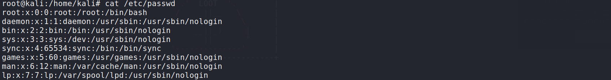

### 常用命令

```
who   查看当前登录用户（tty本地登陆  pts远程登录）

w    查看系统信息，想知道某一时刻用户的行为

uptime  查看登陆多久、多少用户，负载
```

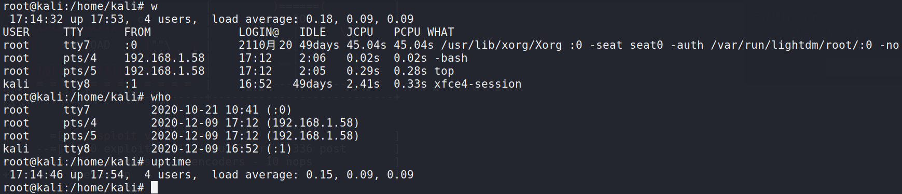

## 排查可疑账号

### 1.查询管理员权限用户

root@kali:~/Desktop# 

```
打印出uid为0的用户的名称 -F 表示进行拆分

awk -F: '$3==0{print $1}' /etc/passwd
```

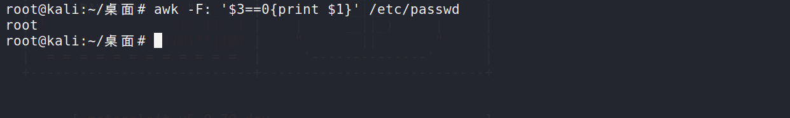

### 2.查询可以远程登录的用户

```
awk '/\$1|\$6/{print $1}' /etc/shadow
usermod -L 用户名 表示锁住用户	(查看/etc/shadow，锁住用户有!)
usermod -U 用户名 表示解锁用户 (查看/etc/shadow，未锁住用户没有!)
```

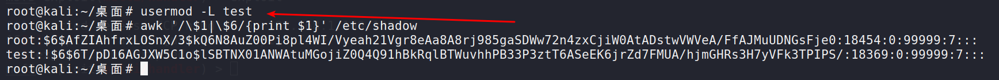

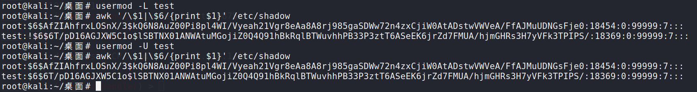

### 3.是否有权限错误配置的用户:

```
-v 表示反向匹配(就是过滤以#开头的内容)
sudo cat /etc/sudoers | grep -v "^#" | tr -s '\n'
sudo cat /etc/sudoers | grep -v "^#" | tr -s '\n' | grep "ALL=(ALL)"
sudo cat /etc/sudoers | grep -v "^#" | tr -s '\n' | grep "ALL=(ALL:ALL) ALL"
```

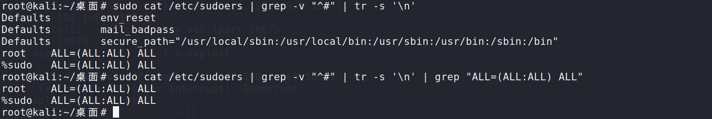

### 账户禁用

```
usermod -L user   禁用帐号，帐号无法登录，/etc/shadow第二栏为!开头

userdel user    删除user用户

userdel -r user   将删除user用户，并且将/home目录下的user目录一并删除
```

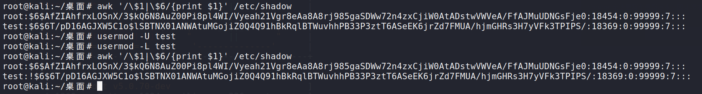

## 查看历史命令

```
1.Root的历史命令查看: history

2、打开/home各帐号目录下的.bash_history，查看普通帐号的历史命令

清除历史记录
history -c 
```

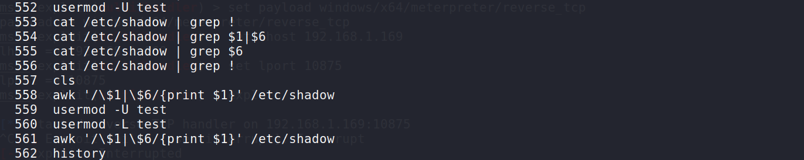

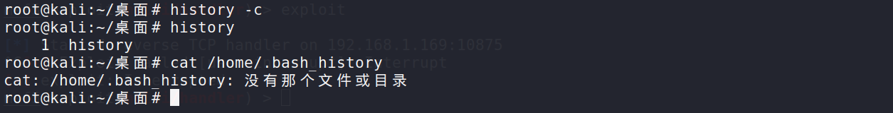

## 检查异常端口

**根据端口找到异常进程**

```
netstat -antlp | grep ESTABLISHED 
箭头对应的就是进程id

查看下pid所对应的进程文件路径

2.运行
ls -l /proc/$PID/exe
file /proc/$PID/exe（$PID 为对应的pid 号）
```

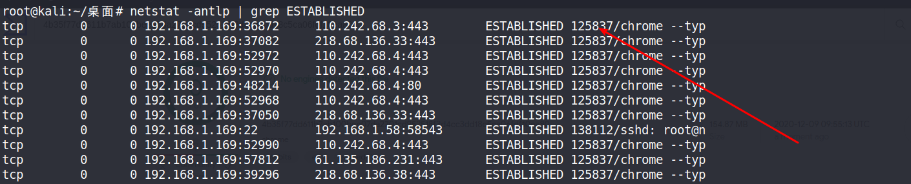


查看下pid所对应的进程文件路径

2.运行ls -l /proc/$PID/exe或file /proc/$PID/exe（$PID 为对应的pid 号）

```
ls -l /proc/125837/exe
file /proc/125837/exe
ps -aux | grep 125837
```

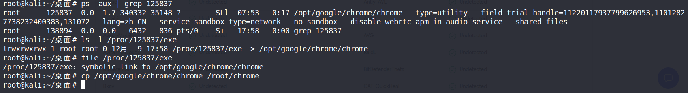

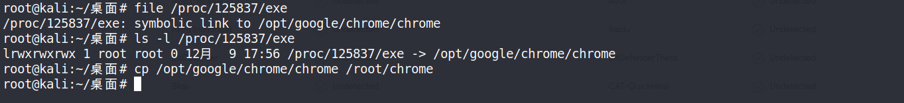

得到怀疑程序后，复制上传到微步在线或者virustotal检测

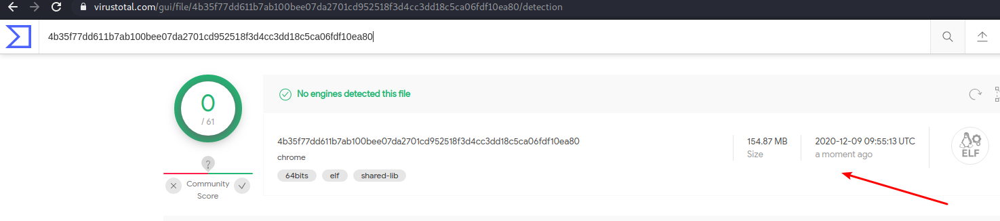


## 检查开机启动项

```
/etc/rc.local

/etc/rc.d/rc[0~6].d

ls -alt /etc/init.d/
```

启动项文件： more /etc/rc.local  /etc/rc.d/rc[0~6].d ls -l /etc/rc.d/rc3.d/

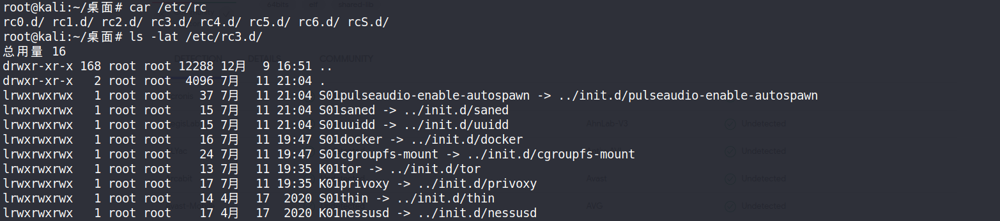

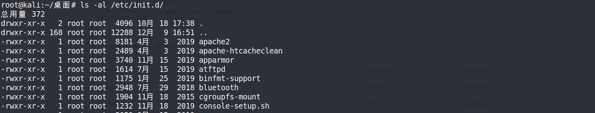

## 检查定时任务

```
crontab -l 列出某个用户cron服务的详细内容

crontab –e 修改定时任务

通过使用crontab –l指令, 不会把我们下面的列出来的这些文件里面的定时任务都展示出来,但是不影响定时任务的执行.

/var/spool/cron/* 

/etc/crontab(这里面的内容,不会显示在crontab中)

/etc/cron.d/*

/etc/cron.daily/* 

/etc/cron.hourly/* 

/etc/cron.monthly/*

/etc/cron.weekly/

/etc/anacrontab

/var/spool/anacron/*
```

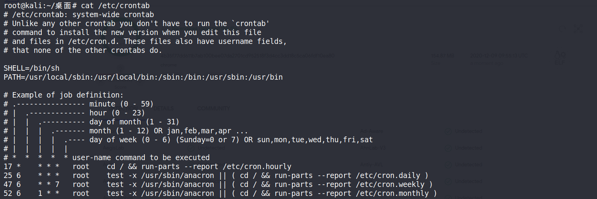

## 检查异常文件

```
1、查看敏感目录，如/tmp目录下的文件，同时注意隐藏文件夹，以“..”为名的文件夹具有隐藏属性
	使用ls- la

2、得到发现WEBSHELL、远控木马的创建时间，如何找出同一时间范围内创建的文件？
 	可以使用find命令来查找，如 find /opt -iname "*" -atime 1 -type f 找出 /opt 下一天前访问过的文件

3、针对可疑文件可以使用stat进行创建修改时间。
	stat 文件名称
	可以使用touch进行修改
	touch 直接更改所有参数
```


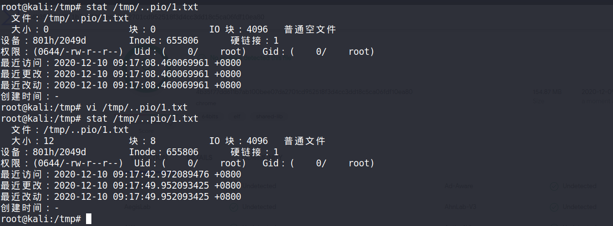

## 检查系统日志

```
日志文件
说明
var/log/secure
	登录成功或者错误记录验证和授权方面的信息，su切换用户，sudo授权，甚至添加用户和修改用户密码都会记录在这个日志文
件中,如果该文件很大，说明有人在破解你的 root 密码

var/log/cron
	记录了系统定时任务相关的日志
lvar/log/cups
记录打印信息的日志
记录了系统在开机时内核自检的信息，也可以使用dmesg命令直接查看内核自检信
/varllog/dmesg
息
/var/log/mailog
记录邮件信息
记录系统重要信息的日志。这个日志文件中会记录Linux系统的绝大多数重要信
/lvarllog/message
息，如果系统出现问题时，首先要检查的就应该是这个日志文件
记录错误登录日志，这个文件是二进制文件，不能直接vi查看，而要使用lastb命令
/var/log/btmp
查看
记录系统中所有用户最后一次登录时间的日志，这个文件是二进制文件，不能直接
lvar/log/lastlog
vi，而要使用lastlog命令查看
永久记录所有用户的登录、注销信息，同时记录系统的启动、重启、关机事件。同
/var/log/wtmp
样这个文件也是一个二进制文件，不能直接vi，而需要使用last命令来查看记录当前已经登录的用户信息，这个文件会随着用户的登录和注销不断变化，只记
/var/log/utmp
录当前登录用户的信息。同样这个文件不能直接vi，而要使用w,who,users等命令来
查询
记录验证和授权方面的信息，只要涉及账号和密码的程序都会记录，比如SSH登

很多linux的新发行版已经不再使用，改为使用rsyslog。
	查看rsyslog的配置目录 /etc/rsyslog.d
```


​		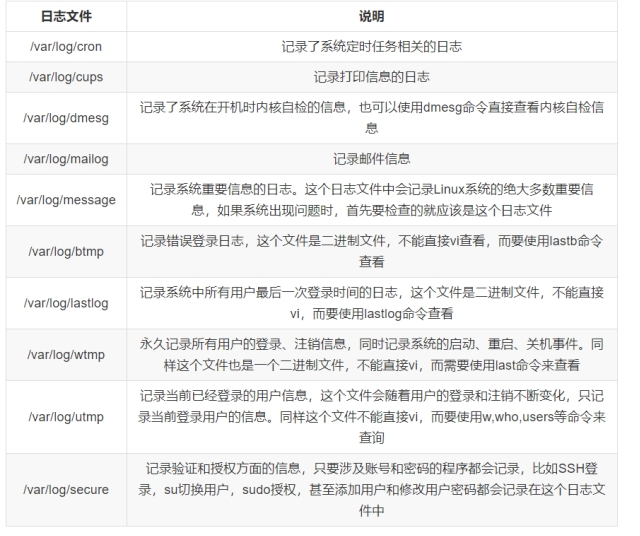

## 日志排查

```
lastlog
系统中所有用户最近一次登录信息
```

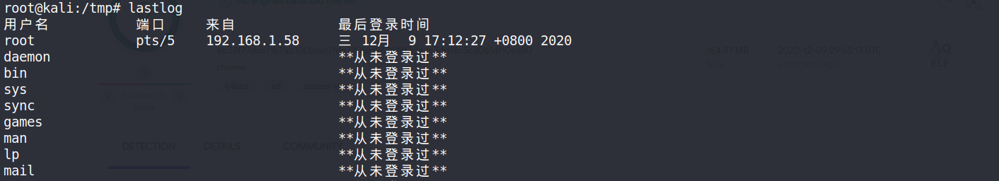

```
lastb
用于显示用户错误的登录列表
```

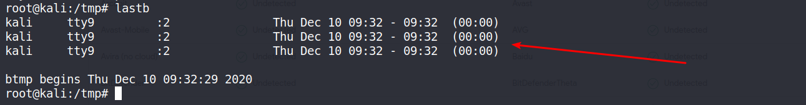


## 通过杀毒软件进行检测(Clamav)

```
严格按照这个步骤:

# Ubuntu安装Clamav

mark@ubuntu:~$ sudo apt-get install clamav

mark@ubuntu:~$ sudo apt-get install clamav-daemon

mark@ubuntu:~$ sudo freshclam

mark@ubuntu:~$ sudo lsof /var/log/clamav/freshclam.log

mark@ubuntu:~$ sudo systemctl stop clamav-freshclam.service

mark@ubuntu:~$ sudo freshclam

mark@ubuntu:~$ clamscan -r /home # 扫描用户文件夹

./clamscan -r –v --bell -i /bin  扫描bin目录并且显示有问题的文件的扫描结果

clamscan -r -i /home  --move=/opt/infected  -l /var/log/clamscan.log
```

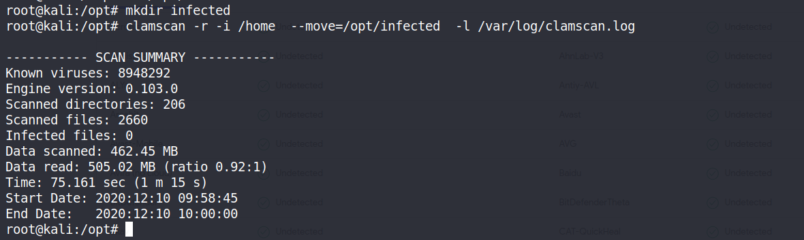

## ROOTKIT查杀

### chkrootkit查杀工具使用

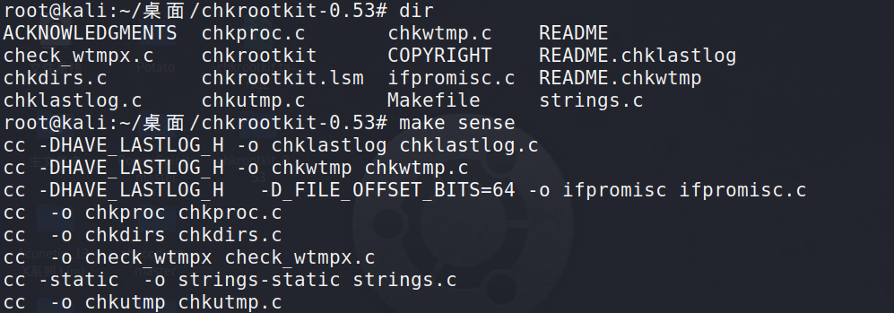

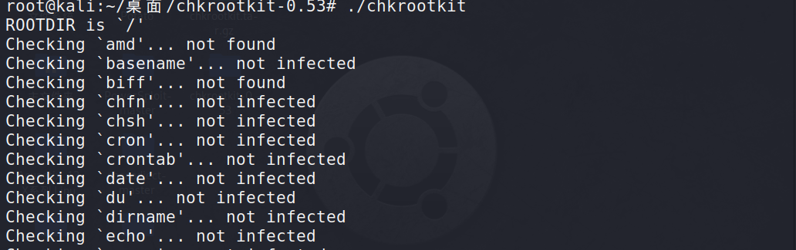

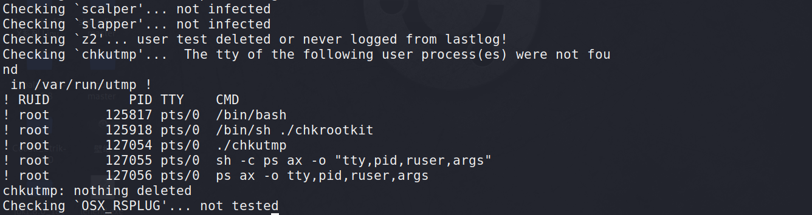

### rootkithunter查杀工具使用

```
tar zxf rkhunter-<version>.tar.gz
cd rkhunter-<version>
./installer.sh --install
rkhunter --check
```

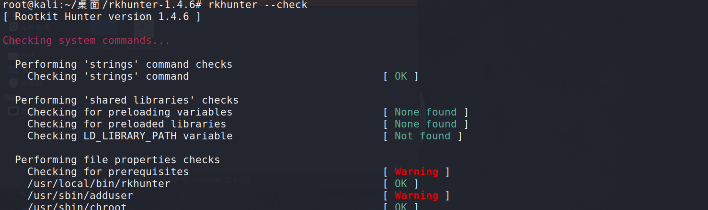

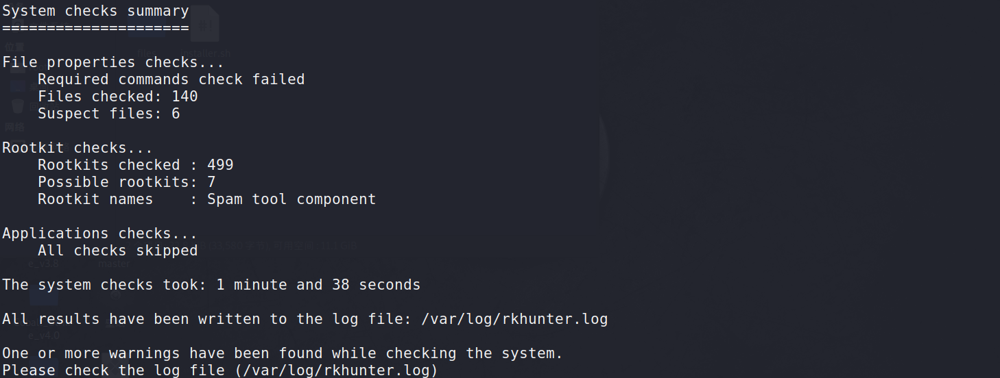

**如果有可疑文件直接复制出来，上传到微步在线、virustotal**

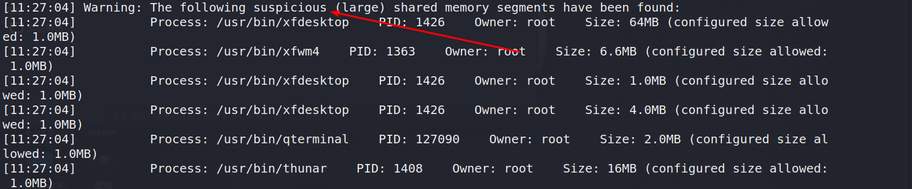