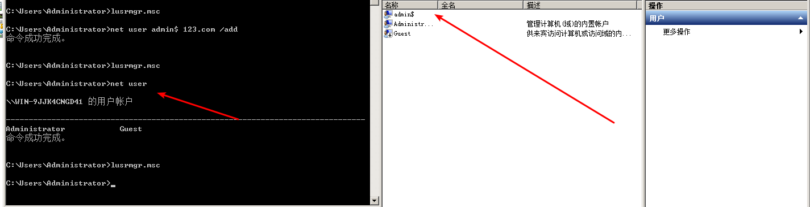
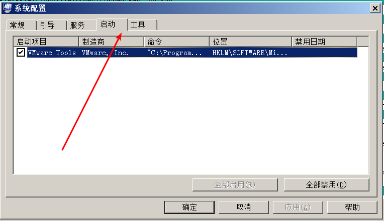

# windows应急响应

## 常见的应急响应事件分类：

web入侵：网页挂马、主页篡改、Webshell

系统入侵：病毒木马、勒索软件、远控后门

网络攻击：DDOS攻击、DNS劫持、ARP欺骗

## 入侵思路排查

### 大致思路:

```
1、检查服务器是否存在弱口令

2、服务器端口是否对公网开放,以及端口建立的连接
	优先查看与外网建立连接进行交互的端口(netstat -ano | findstr "ESTABLISHED")
	通过判断建立连接的，得到对应的进程编号，再通过对应的进程编号得到对应的进程程序
	tasklist | findstr "进程编号id"
	得到怀疑的程序之后将该程序复制之后上传到微步在线或者virustotal进行病毒检测分析
3、判断是否有可疑账户(克隆账户或者影子账户)

4、检查系统windows日志(比如登录日志 查看4624——登陆成功、4625——登录失败)

5、查看异常进程
	通过D盾、火绒剑等工具或者输入msinfo32命令检查是否存在异常进程,如有异常进程，需要进行上传检查
	
6、检查启动项
	查看是否存在命名异常的启动项目(如果有异常的启动程序，找到该程序并将该程序上传到微步在线或者virustotal)如果是病毒则取消勾选命名异常的启动项目，并到命令中显示的路径删除文件。
	
7、检查计划任务
	找到计划任务对应的异常程序，上传进行检测
	
8、检查系统可能存在的漏洞
	通过systeninfo > info.txt 导出系统信息，使用windows漏洞补丁检查脚本进行检查,打上对应的补丁
```

### 查看服务器是否有弱口令，远程管理端口是否对公网开放。

**敏感端口需要询问管理员这些端口真的要开放吗？**

```
重点看3389(远程登录),22(ssh),3306(mysql数据库)等端口
nmap –p 1-65535 –A –T4 10.0.0.0/24  
```

### 判断是否有可疑账号(克隆账户和影子账户)存在

```
检查方法：

打开 cmd 窗口，输入lusrmgr.msc命令，查看是否有新增/可疑的账号，

如有管理员群组的（Administrators）里的新增账户，如有，请立即禁用(不要一上来就删除账号)。
```

 

**使用d盾查看是否有隐藏的克隆账号**

**注册表能查看是否有影子账号**

 

### 检查系统日志

**如何看日志主要查看4625，重点查看登录成功和登录失败的id，以及登录的时间是不是在大半夜**

**对于Windows事件日志分析，不同的EVENT ID代表了不同的意义，摘录一些常见的安全事件的说明:**

  

```
打开 cmd 窗口，输入"eventvwr.msc"，回车运行，
```


  

 ```
打开"事件查看器——>安全"。
如果3389被爆破，一般会出现下面这种一堆4625，登录失败的日志信息
 ```

  

https://www.cnblogs.com/wenzhongxiang/p/10473390.html

### 查看端口明确是否有问题的进程或者程序

##### 优先看建立连接的

##### 与外网进行交互的

**如果怀疑二进制、exe、.dll文件 可以将该文件上传到病毒检测网站**

```
主要查看3389(远程登录)3306(数据库),22(ssh)
1. netstat -ano 查看目前的网络连接，定位可疑的ESTABLISHED 3389.3306,22
netstat -ano | findstr ESTABLISHED


2. 根据netstat 定位出的pid，再通过tasklist命令找到该进程编号对应程序名称
tasklist | findstr "PID"

3.结束恶意程序
    TASKKILL /IM notepad.exe	
    干掉进程名为notepad.exe的进程
    
    TASKKILL /PID 1230 /PID 1241 /PID 1253 /T		
    干掉进程ID为1230、1241、1253的进程及其子进程(/T)
    
    TASKKILL /F /IM cmd.exe /T		
    强制(/F)干掉进程名为cmd.exe的进程及其子进程
    
    TASKKILL /F /FI "PID ge 1000" /FI "WINDOWTITLE ne untitle*"
    强制干掉进程ID大于1000(/FI)且窗口标题不为untitle开头的进程
    
    TASKKILL /F /FI "USERNAME eq NT AUTHORITY\SYSTEM" /IM notepad.exe
    强制干掉进程为所属用于是NT AUTHORITY\SYSTEM的notepad.exe进程
    
    TASKKILL /S system /U domain\username /FI "USERNAME ne NT*" /IM *
    使用用户名为domain\username连接到远程系统(/S)，干掉所有非NT开头的用户的所有进程

    TASKKILL /S system /U username /P password /FI "IMAGENAME eq note*"
    使用用户名为domain\username密码为password连接到远程系统，干掉所有进程名为note开头的进程

```

 

**如果怀疑二进制、exe、.dll文件 可以将该文件上传到病毒检测网站** 

```
例如:
1、微步在线 ——>https://x.threatbook.cn/
2、virustotal——>https://www.virustotal.com/gui/
```

### 查看异常进程

```
就可以查看到进程的详细信息，比如进程路径、进程ID、文件创建日期、dd启动时间等。
```


**1、打开D盾_web查杀工具，进程查看，关注没有签名信息的进程。**

 

**2、火绒剑 查看和启动项**

 

 

**3、开始--运行--输入msinfo32，依次点击"软件环境→正在运行任务"**

	


### 检查启动项

```
1、
单击开始菜单 >【运行】，输入 msconfig，查看是否存在命名异常的启动项目，是则取消勾选命名异常的启动项目，并到命令中显示的路径删除文件。(如果有异常的启动程序，找到该程序并将该程序上传到微步在线或者virustotal)
```



```
2、 单击【开始】>【运行】，输入 regedit，打开注册表，查看开机启动项是否正常，特别注意如下三个注册表项： HKEY_CURRENT_USER\software\micorsoft\windows\currentversion\run HKEY_LOCAL_MACHINE\Software\Microsoft\Windows\CurrentVersion\Run HKEY_LOCAL_MACHINE\Software\Microsoft\Windows\CurrentVersion\Runonce 
检查右侧是否有启动异常的项目，如有请删除，并建议安装杀毒软件进行病毒查杀，清除残留病毒或木马。(如果能找到对应的程序，也需要将该程序上传到微步在线或者virustotal进行检测)
```


### 检查计划任务

```
找到计划任务对应的的程序，上传到微步在线或者virustotal

1. 单击【开始】>【设置】>【控制面板】>【任务计划】，查看计划任务属性，便可以发现木马文件的路径。

2. 单击【开始】>【运行】；输入 cmd，然后输入at，检查计算机与网络上的其它计算机之间的会话或计划任务，如有，则确认是否为正常连接。
```


**命令行操作查看计划任务**

```
at 08 win7
schtasks.exe win10 server 2016
```


### 检查系统相关信息

##### 使用 windows-exploit-suggester.py 对应脚本对导出的系统信息进行漏洞检测

**一定要询问运维是否能够打补丁，很容易打蓝屏**

1. 查看系统版本以及补丁信息(一定要询问运维是否能够打补丁，很容易打蓝屏)
2. 添加防火墙规则，严格限制端口访问

检查方法：单击【开始】>【运行】，输入systeminfo，查看系统信息

将systeminfo导出文件，使用windows cve漏洞检测脚本进行检测

```
systeminfo > systeminfo.txt 使用脚本工具进行检测
```


2. 检查可疑目录

​	单击【开始】>【运行】，输入%UserProfile%\Recent，分析最近打开分析可疑文件

3. 查看登录用户(是否有多余用户登录，控制主机)

​		query user

## 挖矿病毒特征?

```
CPU或GPU占用率非常高
```

### 排查思路?

```
查看CPU或GPU占用较高的进程，找到对应的文件
```

## 勒索病毒特征?

```
文件后缀名被修改，出现勒索信息文件readme.txt
```

### 病毒查杀工具

病毒

```
挖矿

勒索

web病毒
```

```
D盾,360,火绒,卡巴斯基,bitdefender,安全狗等等

卡巴斯基：http://devbuilds.kaspersky-labs.com/devbuilds/KVRT/latest/full/KVRT.exe （推荐理由：绿色版、最新病毒库）

大蜘蛛：[http://free.drweb.ru/download+cureit+free](http://free.drweb.ru/download+cureit+free（推荐理由：扫描快、一次下载只能用1周，更新病毒库）)[（推荐理由：扫描快、一次下载只能用](http://free.drweb.ru/download+cureit+free（推荐理由：扫描快、一次下载只能用1周，更新病毒库）)[1](http://free.drweb.ru/download+cureit+free（推荐理由：扫描快、一次下载只能用1周，更新病毒库）)[周，更新病毒库）](http://free.drweb.ru/download+cureit+free（推荐理由：扫描快、一次下载只能用1周，更新病毒库）)

火绒安全软件：[https://www.huorong.cn](https://www.huorong.cn/)

360杀毒：http://sd.360.cn/download_center.html

### Webshell查杀工具

D盾_Web查杀：http://www.d99net.net/index.asp

河马webshell查杀：[http://www.shellpub.com](http://www.shellpub.com/)

深信服Webshell网站后门检测工具：[ http://sec.sangfor.com.cn/download?file=WebShellKillerTool.rar](http://sec.sangfor.com.cn/download?file=WebShellKillerTool.rar)

Safe3：http://www.uusec.com/webshell.zip

百度webshell查杀:[ https://scanner.baidu.com/#/pages/intro](https://scanner.baidu.com/)

安全狗:

长亭:https://webshellchop.chaitin.cn/
```

