## 正向代理和反向代理

**正向代理:**

```
客服端将请求发给代理服务器，代理服务器接收请求后转发给目标服务器(也就是说，客服端知道最终是哪个服务器处理请求)
```


**反向代理:**

```
将客户端请求通过(边界防火墙)发送给内网中的服务器，客户端只知道边界防火墙会处理对应的请求，但是客户端并不知道对应的内网结构，也就是内网那台服务器处理的请求
```

### 端口转发:

**需要通过中间服务器进行二次转发**

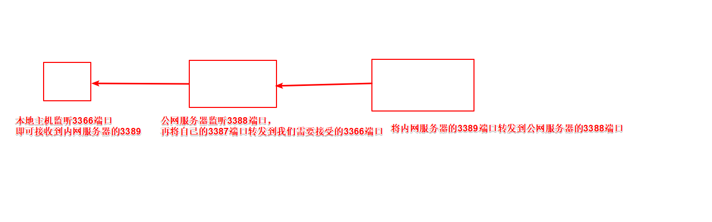

**场景:**

```
目标服务器在内网端口为7001

中间服务器ip为192.168.1.122

要让本机通过端口转发访问内网的7001端口
```

**中间服务器开启监听**

```
lcx.exe -listen 6999 7001
```

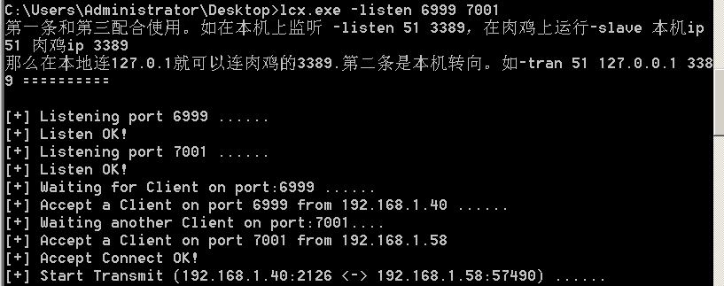

**内网服务器将7001端口交给中间服务器的6999端口**


```
lcx.exe -slave 192.168.1.122 6999 127.0.0.1 7001
```


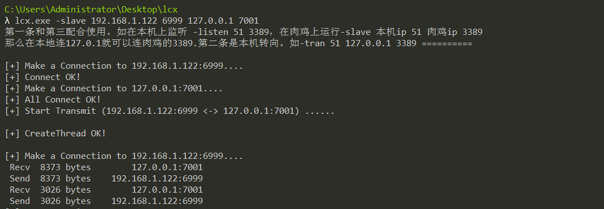

**成功在本地访问内网的7001端口服务(通过访问中间服务器监听的端口即可)**

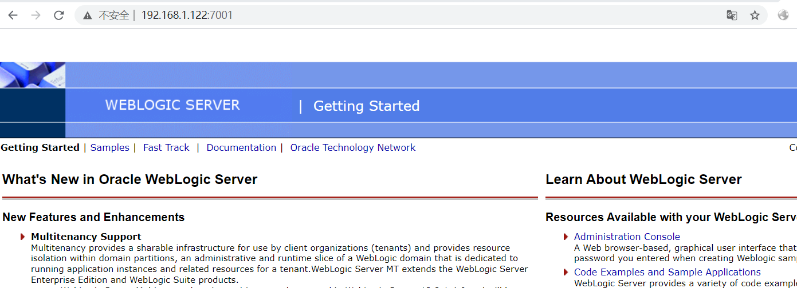

#### ncat正向控制

```
就是自己监听并且使用 -c/-e cmd.exe
```


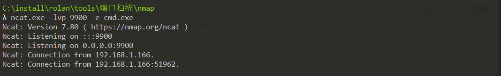

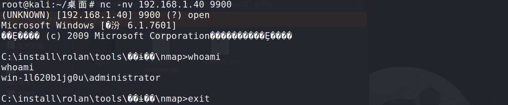

#### ncat反向控制

```
就是将自己的cmd带着交给被监听的一端
```

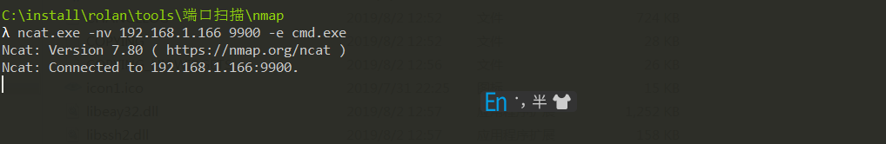

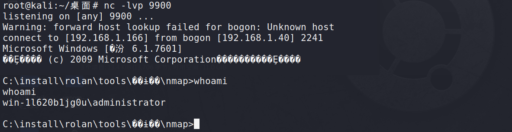


#### venom

**多级代理工具，linux和windows都支持,和termit白蚁很相似**

win7

```
admin节点和agent节点均可监听连接也可发起连接
admin.exe -lport 9999
```

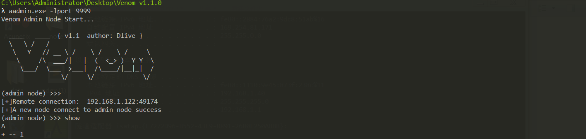

08

```
作为客服端连接
agent.exe -rhost 192.168.1.40 -rport 9999
```

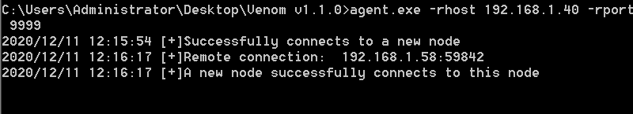

win7

进入1(08) 开启监听

```
goto 1
listen 6666
```

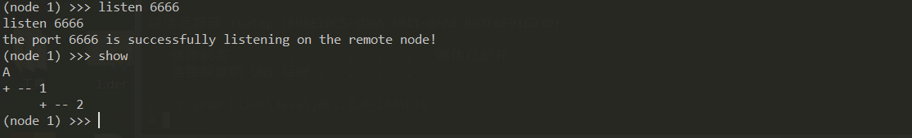

win10-1

```
作为客服端连接08
agent.exe -rhost 192.168.1.122 -rport 6666 
```


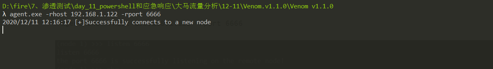

win10已经成功连接08

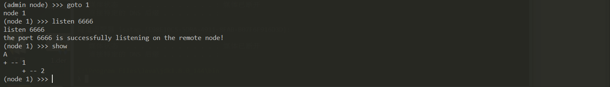

win10-2

```
作为客服端连接win7
agent.exe -rhost 192.168.1.40 -rport 9999
```

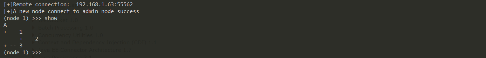


help 可以查看功能

```
shell shell交互模式
upload 文件上传
download 文件下载
listen 监听进入的(id)主机
```

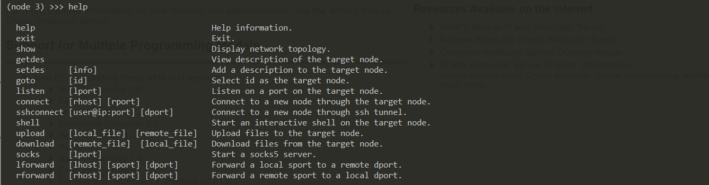

文件上传

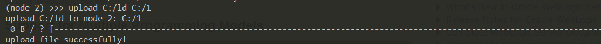


文件下载

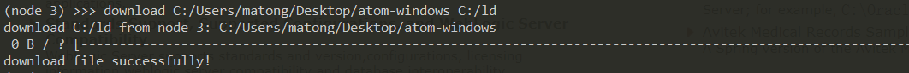


shell交互

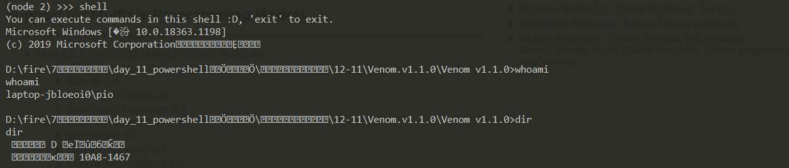


lforward

将运行admin.exe程序的主机对应的端口转发到远程的对应端口

```
这里是node2节点 进行端口转发
```


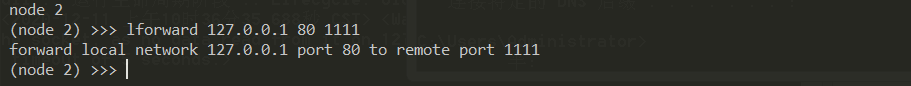


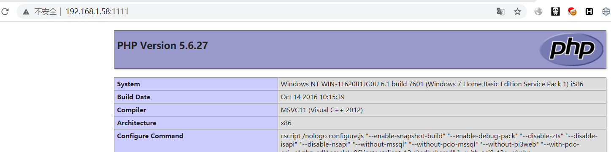


**proxychains** 

修改配置文件配置代理

```
vi /etc/proxychains.conf

socks5 127.0.0.1 port (可以配置对应的ss代理)
```

**使用proxychains 加上对应的命令在想使用代理但是软件就是不走代理的命令前，加上`proxychains`，就能自动走代理**

```
proxychains nmap -sS ip
proxychains 
```

